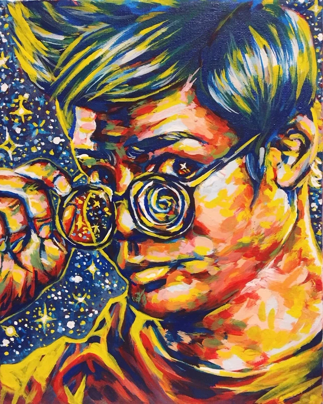

# Bonus
## Music Awards
- Achieved Level 10 Flute and Level 10 Harmony and Counterpoint (2nd highest levels at the Royal Conservatory of Music)
- Placed 2nd in Level 10 Woodwinds at the 2020 OMFA Provincials Competition

## Art Portfolio

_"Hyperspeed" (medium: acrylic paint)_

My art is located [here](https://rebeccadvn.wixsite.com/portfolio)!

## Bonus Facts
- I'm half Italian, half Jamaican
- I can beat Dr. Robotnik's Mean Bean Machine (fast-paced Tetris-like game) on the hardest difficulty
- I love prog rock (any fans of Dream Theater or Porcupine Tree?)
- My current hobbies are knitting, learning the alto sax and the piano, singing/songwriting, and making jewelry
- In the cats vs. dogs debate, I am the rare person that picks birds :P

[back](./)