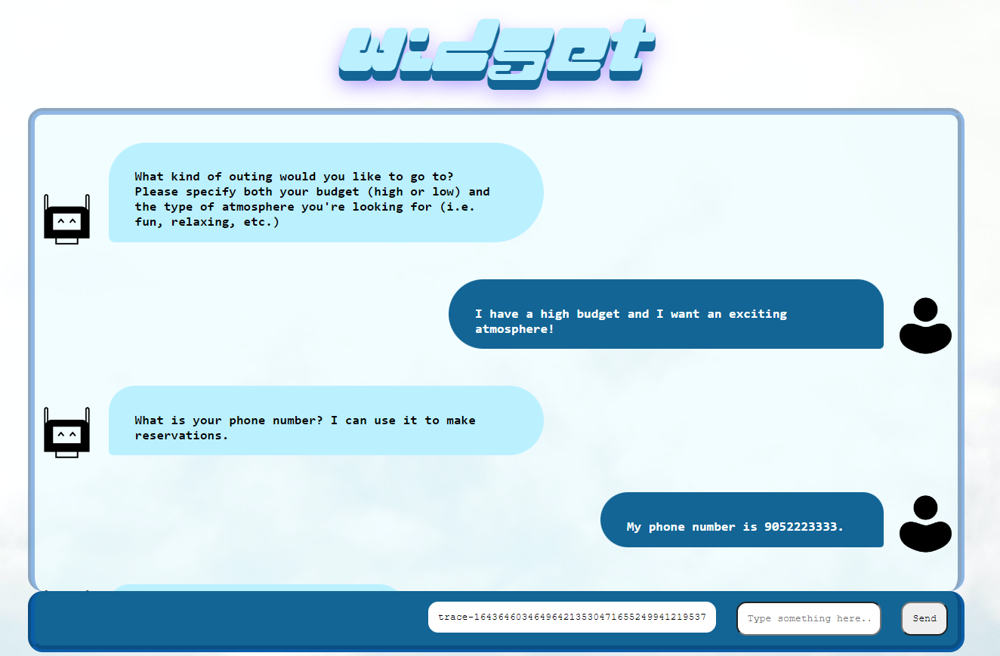
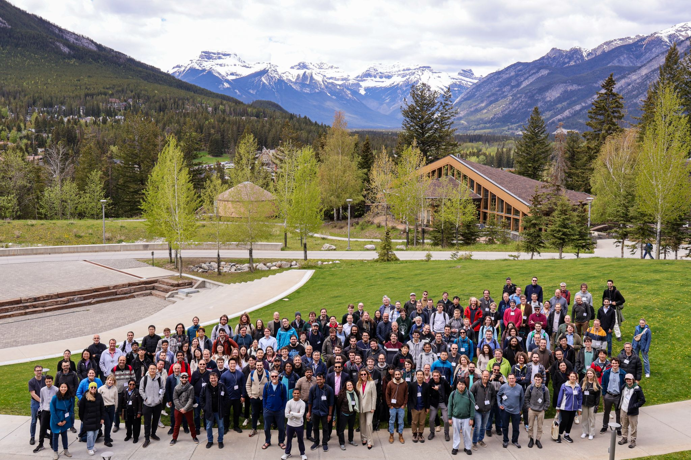

# The Dialogue Planning Initiative

The project GitHub is [here](https://github.com/dialogue-planning).

Dialogue planning is a subset of task-oriented dialogue agent development that uses automated planning to generate dialogue graphs for navigating conversations. The declarative nature of planning creates dialogue agents that are both flexible and verifiable.

Despite the 40+ papers in the space, dialogue planning is not widely adopted as the community is missing an accessible and maintainable system for dialogue planning development. Our goal is that dialogue-planning will flourish into a hub for dialogue planning research and development.

### Plan4Dial
As an intern to the Mulab from May 2022 to Aug 2023, my job was to spearhead the dialogue planning initiative by creating Plan4Dial, which takes a user-specified YAML file as input (which details what the chatbot can do) and a PDDL file for dialogue planning as output. This PDDL can then be passed to a planner to generate a dialogue tree, which can be executed through a plan executor and then served as a web-embeddable widget. 

To give more detail, with just one user-specified YAML file as input, Plan4Dial offers:

- Direct translation to PDDL, eliminating the need to tediously handwrite PDDL

- Full specification + training of an NLU model through Rasa’s NLU-only interface, along with custom pipeline components

- The ability to specify how individual entities are extracted

- Support for custom action templates

- The ability to run and deploy agents through our extension of IBM’s contingent plan executor (Hovor) and our embeddable web UI (WIDGET)

- Support for custom outcome determiners (created in Hovor)

The declarative nature of Plan4Dial allows you to get a chatbot running (and even embedded) quickly and allows you to throw in new actions and variables at any point in development.

Plan4Dial was presented as a Systems Demonstration at ICAPS 2023 in Prague, Czechia.

### Conversation Alignment
Conversation Alignment, co-authored with Natalie Nova, is an expansion to the dialogue planning initiative that allows the developer to assess the agent's capabilities against conversation corpora. This was achieved using "conversation alignment," a tailored beam search algorithm to explore how well the agent can "align" its own capabilities with given conversation examples. The algorithm identifies gaps in what the agent can handle and gives the developer useful metrics on where the agent is failing in its conversations, e.g. actions that the agent seemingly failed to execute.

### FRICODILE

_photo from ICAPS 24, where FRICODILE was presented_

FRICODILE is a collaboration with Prakash Jamakatel and Jane Jean Kiam from the University of the Bundeswehr Munich, Germany, which sprang out of a connection made at ICAPS 2023. The name "FRICODILE" stems from a prior project of theirs, "FRICO" (An AI-Enabled **Fri**endly **Co**ckpit Assistance System), and "DILE" from **DI**A**L**OGU**E**. In short, FRICO is an AI system for assisting pilots in single pilot operations, i.e. pilots with no co-pilot, with the process of flying and operating the aircraft. The project was then augmented with dialogue capabilities through Plan4Dial, allowing for a more "active" and engaging co-piloting system, creating FRICODILE. I was the second author on this project, and provided guidance on how to implement Plan4Dial with the aviation system. Currently, the system exists as a digital flight simulation.

I co-presented FRICODILE as a Systems Demonstration at ICAPS 2024 in Banff, Canada. It was also published at IJCAI and presented by the primary researchers.  The IJCAI paper was also selected by the FAA (Federal Aviation Administration) to be presented as an invited talk in June 2025 as part of their series on "New and Emerging Aviation Technologies." The talk will be delivered to members of government agencies, including the FAA, NASA, DOT, OST, NTSB, DOD, MITRE, and VOLPE.

A demo of FRICODILE can be viewed below:

<iframe width="560" height="315" src="https://www.youtube.com/embed/1nOUfo2ENQk?si=S-MK_o6udQpk0Fv7" title="YouTube video player" frameborder="0" allow="accelerometer; autoplay; clipboard-write; encrypted-media; gyroscope; picture-in-picture; web-share" referrerpolicy="strict-origin-when-cross-origin" allowfullscreen></iframe>

[back](./projects-landing.html)