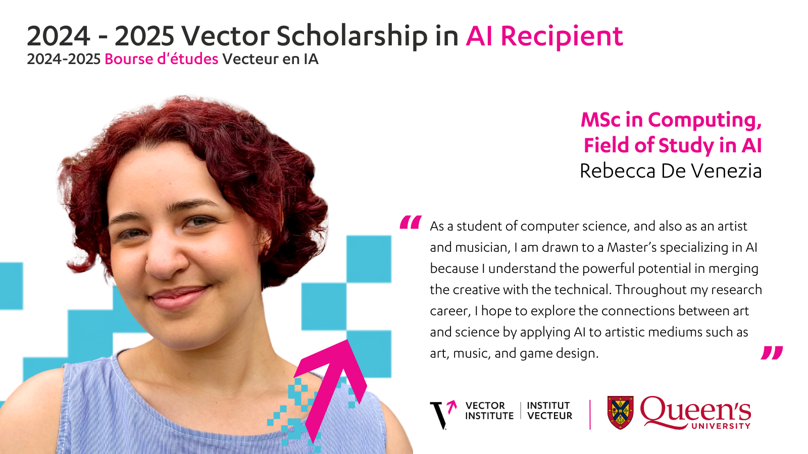

_headshot for Vector AI scholarship_

# About Me
Hi there! I'm a first year Computing/AI MSc student. I'm currently researching how epistemic planning can be augmented with BDI (beliefs-desires-intentions) agent architecture to create more human-like agents for narrative generation. Outside of school, I love all things artsy and musical (currently learning to play the alto sax). Thanks for stopping by!
## Education
- Queen's University Master of Science in Computing, Field of Study in AI (in progress)
- Queen's University Bachelor of Computing, Specialization in Software Design (2024)
  - Cumulative 4.14/4.3 GPA
  - Graduated with Distinction

## Awards
### Scholarships
- Vector AI  
- NSERC {USRA, CGS-M}
- Queen’s {Chancellor’s, TARRA}
### Competitions
- Team was recipient of the 2024 Creative Computing Showcase: Best Video Game Award (for Stellar Synergy)

# [Projects and Highlights](./projects.html)
# [Publications](./publications.html)
# [Bonus](./bonus.html)