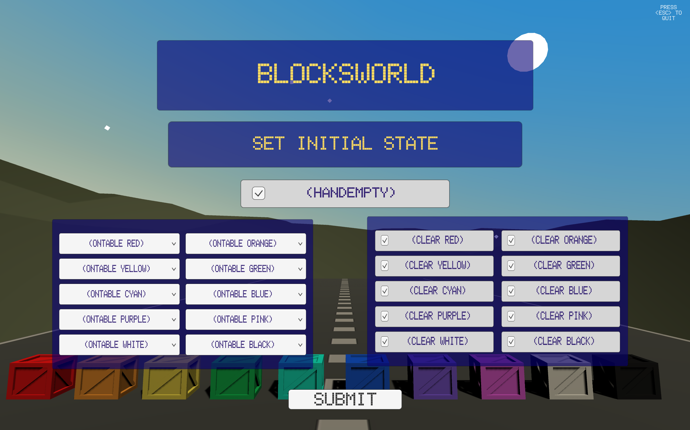

# Projects

## [Suspicious Witches: A Novel Epistemic Planning Domain (part of Master's research)](./suspicious-witches.html)

## [Stellar Synergy (Game)](./stellar-synergy.html)

## [The Dialogue Planning Initiative](./dialogue-planning.html)

## [MACQ (Model Acquisition)](./macq.html)

## [Blocksworld Simulator](./blocksworld-sim.html)

<!-- ## [Time to Kill (Game)](./time-to-kill.html)
 -->

[back](./)