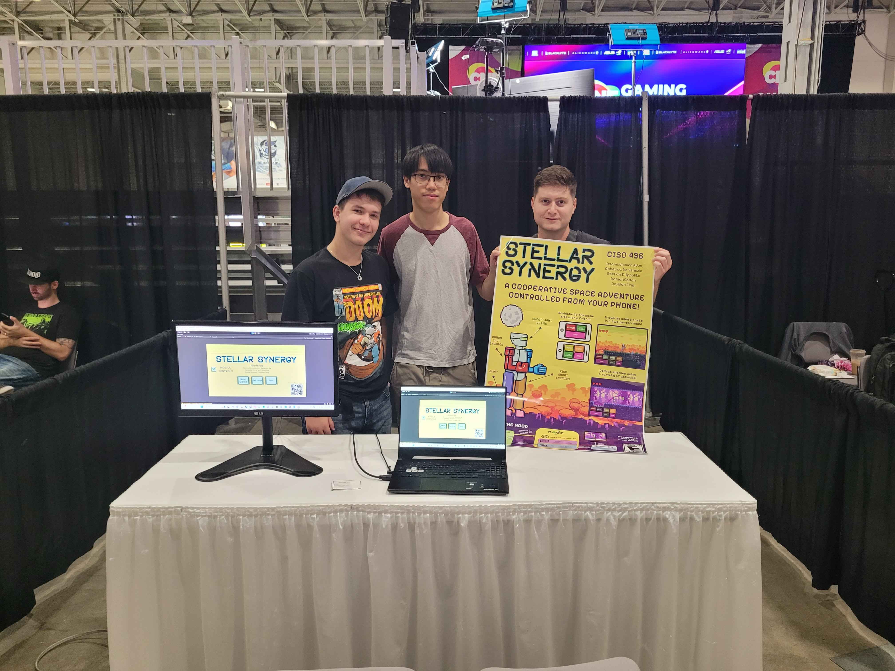
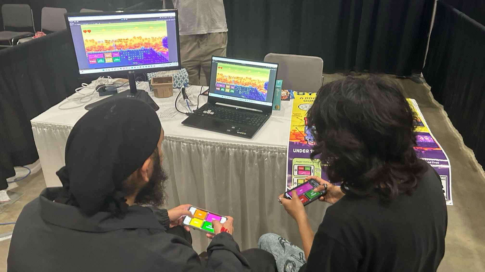
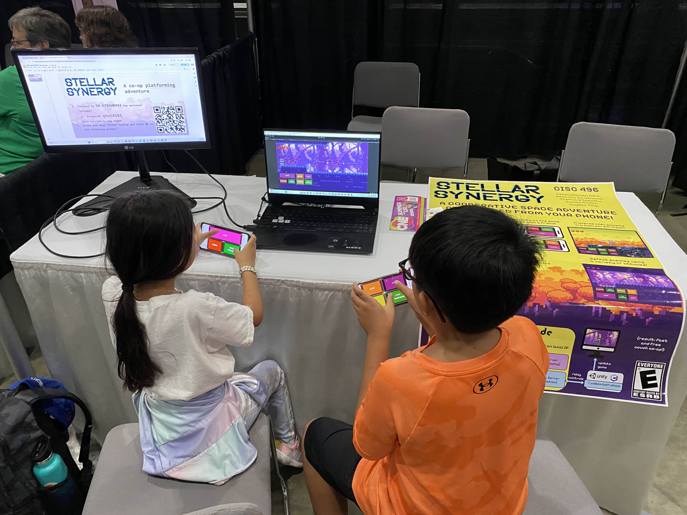
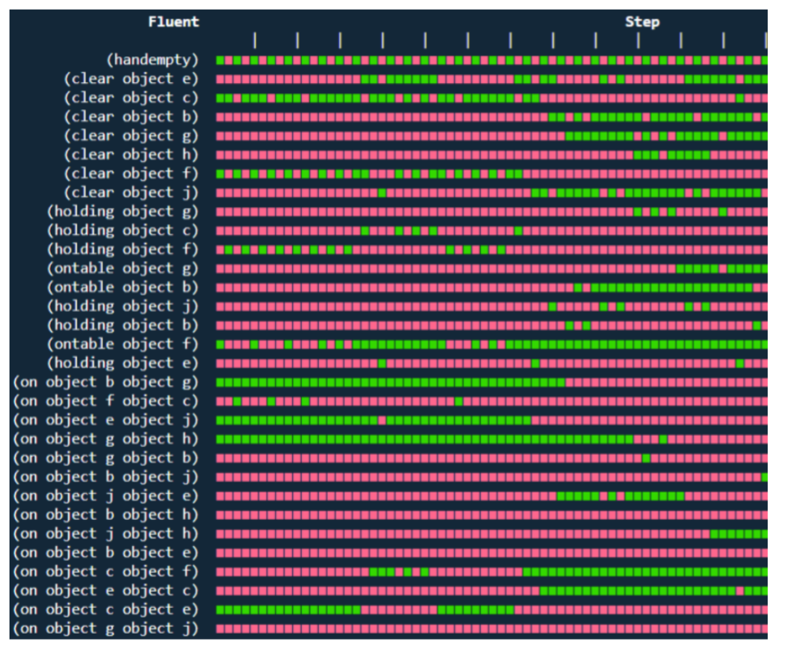
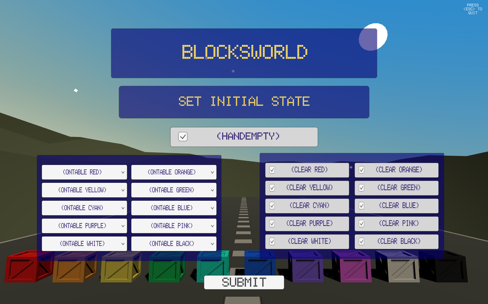
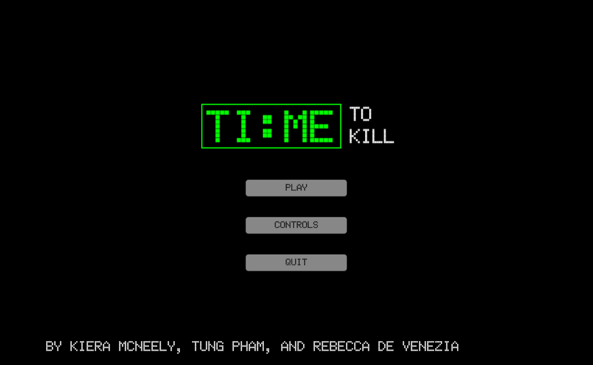

# Projects

## Suspicious Witches: A Novel Epistemic Planning Domain (part of Master's research)
[The Github for this project is currently private.]

## Stellar Synergy
The. Since the game is multiplayer and requires a server for remote connection, and the team didn't have access to a central server, it is not available to play online. However, the [project GitHub](https://github.com/jayttk02/CISC-496-GDP-2) includes instructions to play the game using your local device as the server, with multiplayer and mobile phone controls enabled!

<!--  -->

You can watch the demo video here:

<iframe src="https://player.vimeo.com/video/1008225173?badge=0&amp;autopause=0&amp;player_id=0&amp;app_id=58479" frameborder="0" allow="autoplay; fullscreen; picture-in-picture; clipboard-write" style="position:absolute;top:0;left:0;width:100%;height:100%;" title="Stellar Synergy Demo"></iframe>

## Dialogue Planning Project
The project GitHub is [here](https://github.com/dialogue-planning).

#### Plan4Dial

#### Conversation Alignment
#### FRICO

## MACQ (Model Acquisition)
The project GitHub is [here](https://github.com/AI-Planning/macq).

## Blocksworld Simulator
The project GitHub is [here](https://github.com/beckydvn/Blocksworld-Unity3D-Simulation).

## Time to Kill
The project GitHub is [here](https://github.com/beckydvn/Time-To-Kill-full-game). The game is playable [here](https://tungpham2001.github.io/).

[back](./)