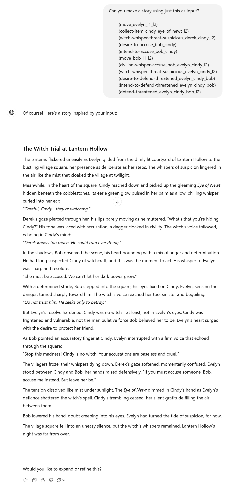

# Suspicious Witches: A Novel Epistemic Planning Domain (part of Master's research)
[The Github for this project is currently private.]

### Abstract

Multi-agent epistemic planning is a sub-field of artificial intelligence that enables problem-solving for domains with multiple agents, where each agent has their own beliefs about the world and can reason about the world and the beliefs of others. However, there has not been much exploration on incorporating desires and intentions into planners, which would result in a new methodology for creating BDI (beliefs-desires-intentions) agents. We are interested in augmenting epistemic planning with the BDI framework to leverage both the efficient planning present in state-of-the-art (SOTA) epistemic planners as well as the human-like reasoning capabilities of BDI. Such a planner would be both efficient and practical in creating human-like agents for narrative planning, the use of automated planning for story generation. First, we would like to motivate the need for this novel planner. Thus, the main contribution of this work is a handcrafted domain ("Suspicious Witches", based on the Salem Witch Trials) that exposes the impracticality of using a SOTA epistemic planner for encoding desires and intentions. We systematically evaluated this domain by observing how the depth of nested belief and the size of the problem affected solution time complexity. We also describe our observations when encoding desires and intentions. Finally, we also demonstrate that our novel domain is complex enough to serve as a new benchmark for epistemic planning research. 

### Future Work
I am interested in applying this work to narrative planning, i.e. using planning for story generation, by adding an LLM to the pipeline. I tested this out by pasting the plan output into Chat-GPT. Even when giving no further instructions, the output is promising:
 

[back](./projects-landing.html)